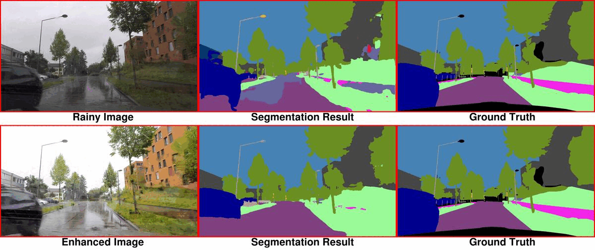

# GIQE : Generic Image Quality Enhancement via Nth Order Iterative Degradation (CVPR 2022)
Demonstration of GIQE and effect of Image Restoration on DownStream Perception Task (Semantic Segmentation) using adverse weather condition images from [ACDC](https://acdc.vision.ee.ethz.ch/) dataset.

  

  

  

  

